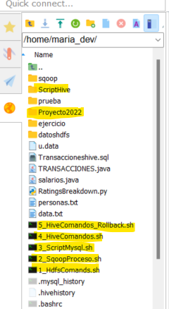

# ProyectoHadoop

Este proyecto esta realizado para presentacion del curso de HADOOP, del grupo 5.
Profesor: Christian Natividad.
## Descripcion
EL Banco XYZ, tiene una Base de datos transaccional en ORACLE, el cual registra todas las transacciones monetarias realizadas por su tarjeta de credito.
El area de Marketing, va colocar un nuevo producto bancario, para un sector de sus clientes, por tal motivo, necesita saber el comportamiento de gastos de dicho sector, por tal motivo, solicita al area de sistemas, data transaccional, esta data y sus consultas no debe afectar al desempeño diario transaccional, que va en horario de oficina.
Por tal motivo se le ofrece al usuario una solucion basada en HADOOP, el cual replicaria su data del ambiente productivo a ambiente BIGDATA, asimismo se le ha ofrecido por lineamiento interno del banco, crear una tabla en MYSQL para que que usuario pueda disponer.
El usuario realizara sus reportes en POWERBI, conectandose directamente a HIVE.

## Elementos
La Instalación consta de archivos y carpetas, que se detallaran:
### Carpetas
- data: La carpeta data contiene los archivos csv, que se han obtenido de la BD transaccional ORACLE
- ScriptHive: Contiene los script para la ejecucion en HIVE.
- powerbi: Contiene el reporte en PowerBi

### Archivos
Todos los archivos presentes tienen un orden de ejecucion, listare los nombres de los archivos y funcionalidad:

- 1_Primero.sh : En este archivo se encuentra los comandos Hadoop, Crear carpetas en HDFS, sube archivos y da privilegios.
- 2_SqoopProceso.sh : Este archivo ejecuta el proceso por el cual los archivos HDFS, pasan a MYSQL por medio de SQOOP.
- 3_ScriptMysql.sh : Este archivo contiene los script para la ejecucion de la creacion de Tablas MYSQL.
- 4_HiveComandos.sh : Este archivo ejecuta los comandos para la creacion de las estructuras de tablas en HIVE.
- 5_HiveComandos_Rollback.sh : Este archivo Borra las tablas en HIVE.

## Instalación
Primero colocaremos los archivos en el servidor de cloudera.
Los archivos y carpeta resaltados, son los que deben estar segun imagen:

```bash
pip install foobar
```
